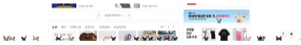

# 🐱 Browser Cat

브라우저 위를 자유롭게 돌아다니는 데스크톱 펫(Desktop Pet) Chrome Extension입니다.

Phaser 4 + Matter.js를 기반으로 제작되었으며, 웹 페이지 위에 고양이를 오버레이하여 실제 브라우저 안에서 살아 움직이는 것처럼 동작합니다.

## 

### ✨ 주요 기능

- 🐱 브라우저 위를 돌아다니는 고양이
- 🌍 모든 웹사이트에서 동작
- 🧱 Matter.js 물리 엔진 기반
- 📏 브라우저 크기 변경 대응
- 🖥️ Chrome Extension
- ➕ 고양이 추가 기능
- 🎞️ Idle / Run 애니메이션

---

### 프로젝트 구조

```
PHASER_PETS/
├── assets/ # 고양이 애니메이션 및 이미지 리소스
│ ├── black-cat-idle.png
│ ├── black-cat-run.png
│ ├── brown-cat-idle.png
│ ├── brown-cat-run.png
│ ├── orangetabby-cat-idle.png
│ ├── orangetabby-cat-run.png
│ ├── siamese-cat-idle.png
│ ├── siamese-cat-run.png
│ ├── tuxedo-cat-idle.png
│ ├── tuxedo-cat-run.png
│ ├── white-cat-idle.png
│ └── white-cat-run.png
├── config.js # Phaser 및 프로젝트 전역 설정
├── content.js # 크롬 확장프로그램 컨텐츠 스크립트 (웹페이지 주입/오버레이)
├── game.js # Phaser 게임 인스턴스 생성 및 초기화
├── manager.pet.js # 펫(고양이) 생성·생성 주기 관리 매니저
├── manager.wall.js # 화면 경계(벽) 및 충돌 범위 관리 매니저
├── manifest.json # 크롬 확장프로그램(Chrome Extension) 설정 파일
├── pet.cat.js # 고양이 객체의 상태, 이동, 동작 로직
├── phaser_v4.2.1.esm.js # Phaser 3/4 게임 엔진 라이브러리 모듈
└── scene.main.js # 메인 Phaser Scene (게임 화면 메인 렌더링/루프)
```

---

### 에셋 출처

Cat Sprites: [carysaurus on itch.io](https://carysaurus.itch.io/)
